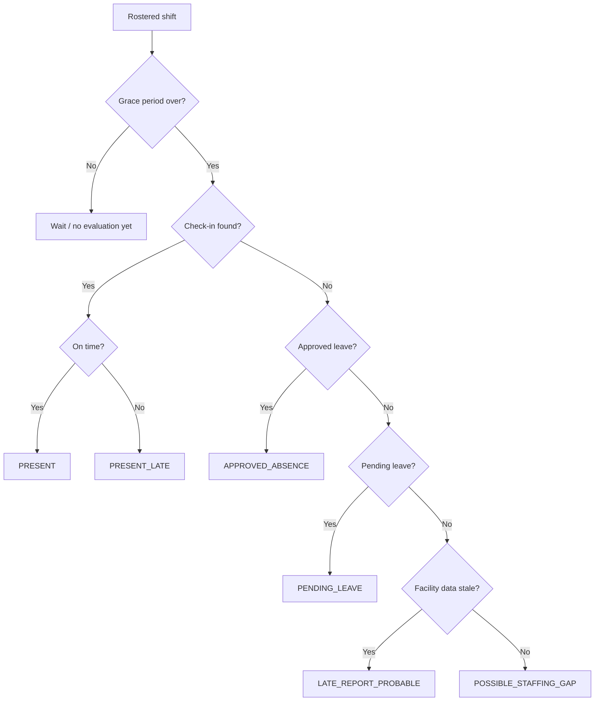
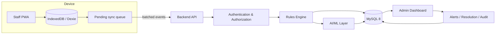
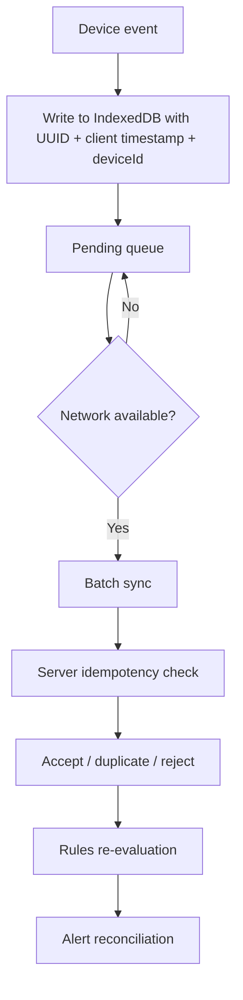
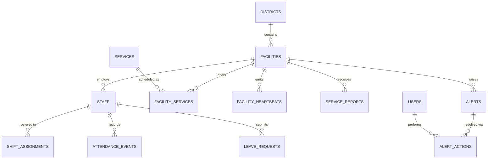

# PHC Pulse

**An offline-first service-readiness platform for monitoring whether Primary Health Centres can actually deliver their planned services.**

> *"Can this PHC actually serve patients today?"*


| | |
|---|---|
| **Live Demo** | [ADD LIVE DEMO URL] |
| **Documentation** | [ADD DOCS URL] |
| **Demo Video** | [ADD DEMO VIDEO URL] |
| **Repository** | [ADD REPOSITORY URL] |

---

## Table of Contents

1. [Project Snapshot](#project-snapshot)
2. [The Problem](#the-problem)
3. [Our Solution](#our-solution)
4. [Why PHC Pulse Is Different](#why-phc-pulse-is-different)
5. [Core Features](#core-features)
6. [How the Decision Engine Works](#how-the-decision-engine-works)
7. [System Architecture](#system-architecture)
8. [Offline-First Architecture](#offline-first-architecture)
9. [AI / ML Architecture](#ai--ml-architecture)
10. [Data Model](#data-model)
11. [User Roles & Workflows](#user-roles--workflows)
12. [Demo Scenarios](#demo-scenarios)
13. [Tech Stack](#tech-stack)
14. [Project Structure](#project-structure)
15. [Installation & Local Development](#installation--local-development)
16. [API Documentation](#api-documentation)
17. [Environment Variables](#environment-variables)
18. [Testing](#testing)
19. [Engineering Decisions](#engineering-decisions)
20. [Security](#security)
21. [Privacy & Ethical Boundaries](#privacy--ethical-boundaries)
22. [Limitations](#limitations)
23. [Roadmap](#roadmap)
24. [Project Impact](#project-impact)
25. [Hackathon Alignment](#hackathon-alignment)
26. [Demo & Screenshots](#demo--screenshots)
27. [Team](#team)
28. [Contact](#contact)
29. [License](#license)
30. [Acknowledgements](#acknowledgements)

---

## Project Snapshot

| Attribute | Details |
|---|---|
| Project | PHC Pulse |
| Hackathon | HackMatrix 5.0 |
| Problem Statement | HLTH04 — PHC Staffing & Service-Availability Monitoring |
| Domain | Public health operations |
| Architecture | Staff PWA + Backend API + Rules Engine + ML layer |
| Primary Users | Staff, Facility In-Charge, District Administrator |
| Core Innovation | Service-level readiness classification (not headcount) |
| Offline Support | Yes — offline-first staff PWA with delayed sync |
| AI/ML | Gap-likelihood model and multilingual report triage (see [maturity labels](#ai--ml-architecture)) |
| Database | MySQL 8 |
| Status | Prototype (demo/synthetic data) |

---

## The Problem

District health administrators need to know one thing: **can a PHC or subcentre deliver the services it planned to offer today?**

Attendance data alone cannot answer that. A missing check-in can mean:

1. **A real staffing gap** — nobody qualified is there.
2. **An approved absence** — leave was granted; the absence is legitimate.
3. **A delayed report** — the staff member is present, but the device is offline or has not synchronized.

Treating every missing check-in as absence produces false alarms, erodes trust in the system, and hides the cases that matter: an approved leave with **no qualified substitute** is valid for accountability but still leaves patients without a service.

> **Don't confuse no data with no staff.**

---

## Our Solution

**PHC Pulse converts raw attendance signals into service-readiness decisions.**

```
Staffing + Roster + Service Schedule + Leave
+ Facility Freshness + Check-ins + Service Reports
                     │
                     ▼
              Readiness Engine
                     │
                     ▼
   Classification → Severity → Evidence → Confidence
                     │
                     ▼
            Recommended Action
                     │
                     ▼
          Resolution + Audit Trail
```

The platform separates two dimensions that dashboards usually merge:

| Dimension | Question |
|---|---|
| **Accountability** | Was someone absent without approval? |
| **Availability** | Can patients receive the required service right now? |

---

## Why PHC Pulse Is Different

| Traditional approach | PHC Pulse |
|---|---|
| No check-in = absent | No check-in is treated as ambiguous until evidence says otherwise |
| Counts staff | Checks qualified coverage per scheduled service |
| Red/green indicator | Alert with reason code, evidence, and confidence |
| Treats late data as absence | Reconciles delayed data and supersedes stale alerts |
| Online-first | Offline-first staff app |
| Static dashboard | Action-oriented resolution workflow with audit trail |

---

## Core Features

> Feature status labels: **Implemented**, **Partial**, **Planned**. Verify each label against the codebase before release.

| Feature | Description | Status |
|---|---|---|
| Service Readiness Engine | Evaluates qualified staff coverage for each scheduled service | [VERIFY] |
| Multi-state classification | Distinguishes staffing gaps, approved absences, pending leave, and delayed reports | [VERIFY] |
| Evidence-based alerts | Every alert carries type, severity, confidence, reason code, evidence, and recommended action | [VERIFY] |
| Severity engine | Critical / High / Medium / Low based on service impact | [VERIFY] |
| Offline-first staff PWA | Check-in/out and reporting during poor connectivity | [VERIFY] |
| Delayed sync | Local queue synchronized when the network returns | [VERIFY] |
| Automatic reconciliation | Late-arriving valid data supersedes stale alerts | [VERIFY] |
| Leave workflow | Request and approval flow | [VERIFY] |
| Multilingual service reporting | Marathi / Hindi / English | [VERIFY] |
| Admin dashboard | Facility monitoring, readiness matrix, alert queue, resolution | [VERIFY] |
| Audit trail | Alert actions and resolution decisions recorded | [VERIFY] |

---

## How the Decision Engine Works

### Per-staff classification



### Service-level impact

For each scheduled service:

| Condition | Severity |
|---|---|
| Qualified staff = 0 and service is mandatory | **CRITICAL** |
| Qualified staff = 0 and service is non-mandatory | **HIGH** |
| Qualified staff below required minimum | **MEDIUM** |
| Gap exists but the service remains covered | **LOW** |

`SERVICE_INTERRUPTION` is raised from service interruption reports submitted by staff.

### Worked example

```
Rostered:   ANM Sunita, Tuesday 09:00–17:00
Condition:  No check-in by 09:30

Evidence:
  - No approved leave
  - Facility recently synchronized
  - Other staff checked in
  - Connectivity appears healthy

Classification:  POSSIBLE_STAFFING_GAP
Confidence:      High
Service impact:  Immunization has no qualified staff
Action:          Contact facility in-charge / arrange cover
```

---

## System Architecture

> Diagram reflects the intended architecture. Adjust component names to match the actual codebase.



---

## Offline-First Architecture



**Mechanisms:** Service Worker, Workbox, IndexedDB via Dexie, client-generated UUIDs, client timestamps, device IDs, online-event sync, Background Sync where supported, retry with backoff, manual "Sync Now", and facility heartbeat.

**Design principles**

- **No network ≠ no staff.** Connectivity loss is never interpreted as absence.
- **Client event time and server receive time are stored separately.** A check-in made at 09:05 but received at 11:40 must be evaluated as a 09:05 event.
- **UUID idempotency.** Retried batches never duplicate attendance events.
- **Order independence.** Events can arrive in any order and the result converges.
- **Clock-skew checks** guard against unreliable device clocks.

---

## AI / ML Architecture

AI/ML is a **decision-support layer over deterministic operational rules**, not the core of the product. The final system is decision-support, not autonomous healthcare decision-making.

| Component | Purpose | Maturity |
|---|---|---|
| Gap-likelihood model | Refines confidence of `POSSIBLE_STAFFING_GAP` | [Implemented / Prototype / Planned — select one] |
| Calibrated confidence | Turns model output into reviewable confidence levels | [select one] |
| Multilingual report triage | Categorizes Marathi / Hindi / English service reports | [select one] |

```
Operational rules + historical/synthetic signals + ML probability
                        ↓
              Confidence refinement
                        ↓
            Human-reviewable decision
```

```
Report text → Language detection → Classification / triage
            → Category + confidence → Admin review
```

<details>
<summary>Model documentation (complete only what is true)</summary>

| Item | Details |
|---|---|
| Input features | [ADD] |
| Preprocessing | [ADD] |
| Model type | [ADD] |
| Training data | [ADD — state clearly if synthetic] |
| Evaluation method | [ADD] |
| Metrics | [ADD ONLY IF MEASURED] |
| Limitations | Prototype; not validated on real PHC data |

</details>

No accuracy, precision, recall, or benchmark figures are claimed in this repository.

---

## Data Model



Tables: `districts`, `facilities`, `staff`, `services`, `facility_services`, `shift_assignments`, `attendance_events`, `leave_requests`, `facility_heartbeats`, `service_reports`, `alerts`, `alert_actions`, `users`. Implemented with MySQL 8 migrations and seed data. *(Confirm names against your migration files.)*

---

## User Roles & Workflows

| Role | Responsibilities |
|---|---|
| Staff | Check-in/out, leave requests, service interruption reports, sync status |
| Facility In-Charge | Facility monitoring, leave approval/rejection |
| District Admin | Alert monitoring, evidence review, resolution, audit review |
| System | Automated evaluation, re-evaluation after sync, alert superseding |

**Complete journey**

```
Staff misses check-in
→ grace period elapses
→ leave checked
→ facility freshness checked
→ peer activity checked
→ situation classified
→ service impact evaluated
→ evidence-backed alert created
→ admin investigates
→ admin resolves
→ audit trail recorded
```

---

## Demo Scenarios

> Keep only scenarios that are seeded and reproducible in your build.

| ID | Scenario | Setup | Action | System behavior | Expected result |
|---|---|---|---|---|---|
| S1 | Normal check-in | Staff rostered | Checks in on time | Marks present | `PRESENT` |
| S2 | Late check-in | Staff rostered | Checks in after grace | Marks late | `PRESENT_LATE` |
| S3 | Approved leave | Approved leave on date | No check-in | Matches leave | `APPROVED_ABSENCE`; service impact still evaluated |
| S4 | Offline delayed sync | Device offline | Check-in queued, then sync | Re-evaluates using client time | Stale alert superseded |
| S5 | Possible staffing gap | No leave, facility fresh, peers present | No check-in | Rules escalate | `POSSIBLE_STAFFING_GAP` with evidence |
| S6 | Service interruption | Service scheduled | Staff reports interruption | Creates alert | `SERVICE_INTERRUPTION` |
| S7 | Duplicate sync | Batch already accepted | Same batch resent | Idempotency check | Events reported as duplicates; no double count |

---

## Tech Stack

> List only what exists in the repository.

| Layer | Technology |
|---|---|
| Frontend | [Framework], [TypeScript/JavaScript], [UI library] |
| Offline / PWA | PWA, Service Worker, Workbox, IndexedDB, Dexie |
| Backend | [Framework], REST API, JWT authentication *(verify)* |
| Database | MySQL 8 |
| AI/ML | [Framework / model — mark prototype or planned] |
| Infrastructure | [Deployment platform or "local only"] |

---

## Project Structure

<!-- Replace with the real tree, e.g. output of `tree -L 2 -I node_modules` -->

```
[frontend]/     Staff PWA and admin dashboard
[backend]/      API, rules engine, sync endpoint
[database]/     Migrations and seed data
[ml]/           Models and triage code
docs/           Documentation and assets
```

---

## Installation & Local Development

### Prerequisites

- [Node.js version]
- MySQL 8
- [Other requirements]

### Clone

```bash
git clone [ADD REPOSITORY URL]
cd [repository-folder]
```

### Environment

```bash
cp .env.example .env
# fill in values; never commit real secrets
```

### Backend

```bash
cd [backend]
[install command]
[run command]
```

### Database

```bash
[migration command]
[seed command]
```

### Frontend

```bash
cd [frontend]
[install command]
[dev command]
```

### Production build

```bash
[build command]
```

---

## API Documentation

> Fill from actual route files. Do not list endpoints that are not implemented.

| Method | Endpoint | Purpose | Auth |
|---|---|---|---|
| POST | `/api/sync` | Batched offline event synchronization | [Yes/No] |
| [ ] | [ ] | [ ] | [ ] |

### Sync request (illustrative shape)

```json
{
  "deviceId": "device-uuid",
  "facilityId": "facility-id",
  "clientNow": "2026-01-01T09:40:00+05:30",
  "events": [
    {
      "eventId": "uuid-v4",
      "type": "CHECK_IN",
      "staffId": "staff-id",
      "clientTimestamp": "2026-01-01T09:05:00+05:30"
    }
  ]
}
```

### Sync response (illustrative shape)

```json
{
  "accepted": ["uuid-v4"],
  "duplicates": [],
  "rejected": []
}
```

Confirm field names against the implementation before publishing.

---

## Environment Variables

| Variable | Required | Purpose |
|---|---|---|
| `DATABASE_URL` *(or host/user/password/name)* | Yes | MySQL connection |
| `JWT_SECRET` | Yes | Signs authentication tokens |
| [Others actually used] | [ ] | [ ] |

Never commit real values.

---

## Testing

<!-- List only tests that exist: rules engine, sync/idempotency, authorization, API. -->

Testing coverage is currently focused on prototype-critical flows.

```bash
[test command]
```

---

## Engineering Decisions

**Why offline-first?** Poor connectivity must not be interpreted as staff absence.

**Why client timestamps?** Delayed events must be evaluated according to when they actually occurred; server receive time is stored separately.

**Why idempotent sync?** Retries over unreliable networks must not duplicate attendance events.

**Why deterministic rules plus ML?** Rules give explainability and enforce operational constraints; ML assists confidence and triage.

**Why service-level readiness?** Counting staff does not answer whether a specific planned service can operate.

---

## Security

Document only what is implemented. Candidates to confirm:

- JWT authentication
- Role-based authorization enforced on the backend
- Password hashing
- Protected frontend routes
- Input and API validation
- Environment-based secret management
- Audit trail of alert actions

No compliance certifications are claimed.

---

## Privacy & Ethical Boundaries

PHC Pulse is an operational decision-support prototype. It does **not** perform:

- Medical diagnosis
- Biometric surveillance
- Live staff GPS tracking
- Payroll processing
- Autonomous disciplinary decisions

These are deliberate prototype boundaries. The system surfaces evidence and recommendations to authorized administrators, and human review remains essential for consequential decisions.

---

## Limitations

- Prototype uses synthetic/demo data
- No live HMIS integration
- No production government deployment
- ML performance depends on available training data
- Offline synchronization depends on browser capabilities
- GPS and biometrics are intentionally excluded
- Demo environment may not represent all PHC operating conditions

---

## Roadmap

### Next
- [ADD actual near-term items]

### Future — *not currently implemented*
- 7-day service risk forecasting
- Nearby substitute suggestions
- Voice-based service reports
- CSV/PDF reporting
- Real HMIS integration
- Better model calibration
- Production-grade observability
- Multi-district deployment

---

## Project Impact

- Faster identification of service gaps
- Clearer separation of absence from delayed data, reducing false alerts
- Improved administrative visibility at facility and service level
- Resilience to poor connectivity
- Evidence-backed interventions instead of bare red flags

Impact is described qualitatively; no usage or outcome statistics are claimed.

---

## Hackathon Alignment

| Requirement | PHC Pulse implementation |
|---|---|
| Facility profiles | [ADD] |
| Staff assignments | Shift/roster assignments per staff and service |
| Check-ins | Offline-capable check-in/out |
| Approved leave | Leave request and approval workflow |
| Alert generation | Rules engine with severity, confidence, evidence |
| Gap vs leave vs delayed data | Multi-state classification |
| Alert resolution | Resolution workflow with audit trail |
| Offline tolerance | PWA, local queue, idempotent delayed sync |
| AI/ML | Gap-likelihood and report triage (see maturity labels) |

*(Verify against the official HLTH04 statement.)*

---

## Demo & Screenshots

**Live Demo:** [ADD LIVE DEMO URL]
**Demo Video:** [ADD DEMO VIDEO URL]

<!-- Add screenshot: Admin Dashboard -->
<!-- Add screenshot: Staff PWA -->
<!-- Add screenshot: Alert Detail -->
<!-- Add screenshot: Readiness Matrix -->

Example once assets exist:

```md

```

---

## Team

| Name | Role | GitHub | LinkedIn |
|---|---|---|---|
| [Add name] | Team Lead / Full Stack | [Add GitHub] | [Add LinkedIn] |
| [Add name] | Backend / Systems | [Add GitHub] | [Add LinkedIn] |
| [Add name] | AI/ML | [Add GitHub] | [Add LinkedIn] |
| [Add name] | Frontend / UI/UX | [Add GitHub] | [Add LinkedIn] |

---

## Contact

**Project:** PHC Pulse
**Hackathon:** HackMatrix 5.0
**Problem Statement:** HLTH04 — PHC Staffing & Service-Availability Monitoring

**Team Lead:** [Add name]
**Email:** [Add email]
**GitHub:** [Add GitHub]
**LinkedIn:** [Add LinkedIn]

**Repository:** [ADD REPOSITORY URL]

---

## License

License information will be added before public release.

---

## Acknowledgements

- HackMatrix 5.0 and its organizers
- HLTH04 problem statement
- Open-source libraries used by this project *(list actual dependencies)*

---

Built for HackMatrix 5.0 with a simple principle:

**No signal should ever be mistaken for no staff.**

© 2026 PHC Pulse Team
